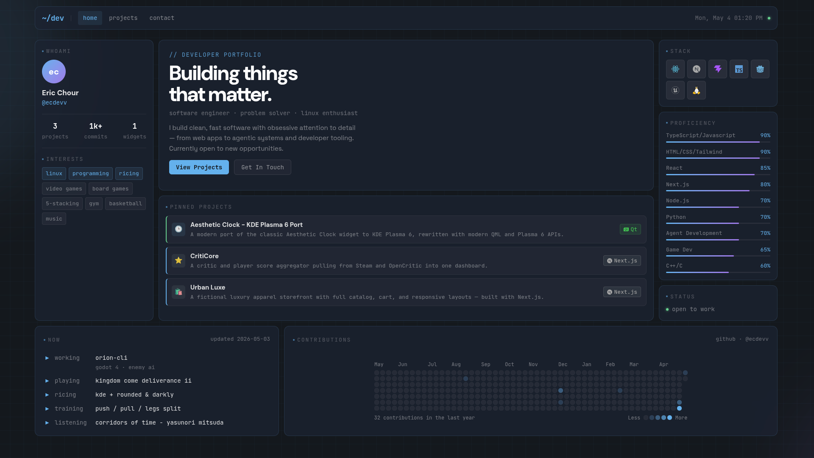

<p align="center">
  <h1 align="center">ec.dev</h1>
  <p align="center">Personal site showcasing projects and work, built with Vite + React + TypeScript + Tailwind CSS v4.</p>
</p>

<p align="center">
  <a href="https://ericchour.com" target="_blank" rel="noopener noreferrer">
    
  </a>
</p>

## Overview
Personal developer portfolio with a riced Linux desktop aesthetic: dark base, dark glassmorphism panels, and aurora orbs. Features a boot sequence animation on first load, project showcase with a master-detail layout, and an interactive shell terminal on the 404 page. No backend; all content lives in local TypeScript files under `src/data/`.

## Stack
- **Build:** Vite 8
- **UI:** React 19, TypeScript 6
- **Styling:** Tailwind CSS v4 (CSS-based config via `@theme` in `index.css`)
- **Routing:** React Router v7
- **Animation:** `framer-motion`, `embla-carousel-react`
- **Icons:** `lucide-react`, `@icons-pack/react-simple-icons`
- **Other:** `clsx`, `react-github-calendar`

## Features
- ⚡ **Boot Sequence:** Animated terminal boot on load - skips on fast connections, replayable via shell
- 📌 **Smart Topbar:** Autohides on scroll with velocity detection, peek zone, and mobile drawer
- 🗂️ **Project Showcase:** Master-detail view with URL-synced state (`?project=:id`) and tag filtering
- 🖼️ **Lightbox:** Image viewer with drag/swipe, keyboard nav, and focus trap
- 💻 **Shell Terminal:** Interactive 404 page with live commands and in-app navigation
- 🔍 **SEO:** `<meta>`, OpenGraph, `robots.txt`, `sitemap.xml`
- ♿ **Accessibility:** Skip link, `aria-*`, `:focus-visible` ring, `prefers-reduced-motion`

## Installation

```bash
# 1. Clone the repository:
git clone https://github.com/ecdevv/ec.dev.git

# 2. Navigate into the repository:
cd ec.dev

# 3. Install dependencies:
npm install

# 4. Run the development server:
npm run dev
```

## License
Code is **MIT-licensed**.

All personal content, photos, and branding remain the exclusive property of **ecdevv** and are not for commercial use or redistribution.
